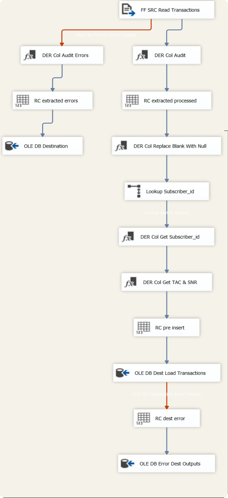
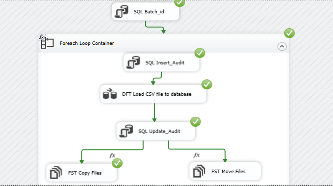
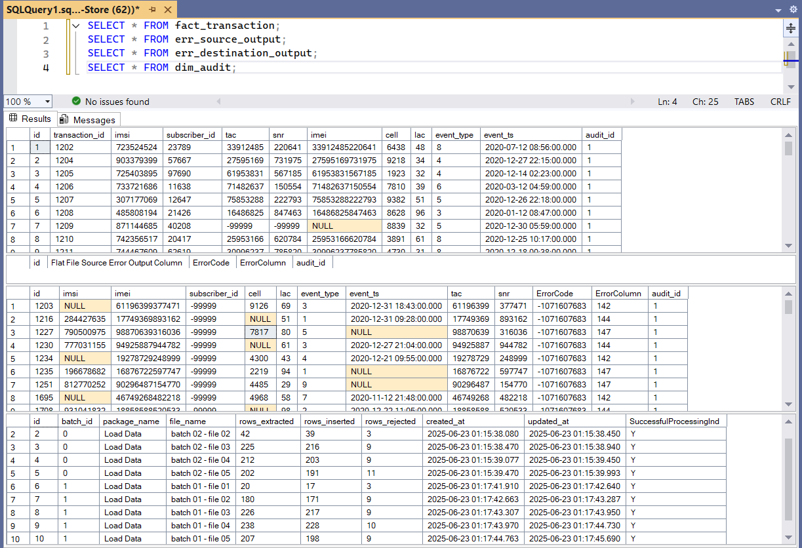

# Telecom Case Study
## **Problem statement**
This is a project that performs an `ETL` (Extract, Transform, Load) pipeline for a telecom company using SQL Server Integration Services ` (SSIS) `. The processed data is loaded into a Data Warehouse ` (DWH) ` designed and built using SQL Server Management Studio ` (SSMS) `. This is an ` end-to-end ETL pipeline ` for a telecom case ensuring data quality and error handling.
## **Source System Overview and Life-Cycle**
Signalling data describes the subscriber network activities and interaction. Subscriber does an event such as call, browsing, latching, SMS, etc.
The network vendor collects the subscriber data in real-time and bulk every 5 min activity in one fill and push it to landing servers.

###  **4G Signaling Data**
Created by [Moustafa Mahmoud](https://gability.com/en/)

The dataset is generated using a script and it does not describe the full telecom dataset for signalling but it simulates the general idea.

### **DataFormat**
This section describes the input data and its format.
| Column      | Data Type | Length | Is Nullable | Sample              |
|-------------|-----------|--------|-------------|---------------------|
| ID          | Int       |        | False       | 156                 |
| IMSI        | String    | 9      | False       | 310120265           |
| IMEI        | String    | 14     | True        | 490154203237518     |
| CELL        | Int       |        | False       | 123                 |
| LAC         | Int       |        | False       | 12                  |
| EVENT_TYPE  | String    | 1      | True        | 1                   |
| EVENT_TS    | Timestamp |        | False       | 16/1/2020 7:45:43   |

The required processing must be completed on this data before storing it in the data warehouse. The processing steps are as follows:

| Column Name  | Mapping Rules                                         | Target Model   |
|-------------- |------------------------------------------------------|----------------|
| ID           | As-is                                                | Transaction_id |
| IMSI         | As-is, reject the record if null                     | IMSI           |
| IMSI         | Join with IMSI reference and get subscriber id, add -99999 if null | subscriber_id |
| IMEI         | Substring first 8 chars, if null or size is less than 15 add -99999 | TAC |
| IMEI         | Substring last 6 chars, if null or size is less than 15 add -99999 | SNR |
| IMEI         | As-is                                                | IMEI |
| CELL         | As-is, reject the record if null                     | CELL |
| LAC          | As-is, reject the record if null                     | LAC |
| EVENT_TYPE   | As-is                                                | EVENT_TYPE |
| EVENT_TS     | Validate the timestamp format to be YYYY-MM-DD HH:MM:SS, reject the record if null | EVENT_TS |

Rejected records will be stored in a separate table, and the original CSV file name will be recorded.

During the data recording process in the database, there is some additional information that needs to be recorded in the `dim_audit table` to ensure the quality of the data storage:
- The number of records in the CSV file.
- The number of records successfully stored in the database.
- The number of rejected records due to not meeting the required conditions.
- Linking the data stored in the database with the original CSV file.

After completing the data storage process in the database according to the before mentioned conditions, Archive the CSV files to another folder.

**Project Phases:**

1. Extract Data from CSV files.
2. Process and transfer data.
3. Deal with data that does not meet the quality requirements, such as Nulls and missing values.
4. Error Handling.
5. Archive files that have been processed and transferred.
6. Audit the processed data.

## **Screenshots**

In this section, you can find screenshots of the different stages of the ETL process, showcasing key stages including data flow, control flow, and the processed data loading into the Data Warehouse (DWH).

### **Data Flow**

### **Control Flow**

### **Sample of loaded data**

